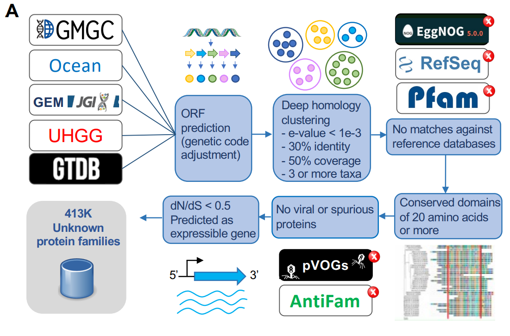

# Pipeline for novel family computation and analysis

Here we present the pipeline for computing novel gene families from the proteomes of a collection of genomes, and how to calculate their genomic context conservation.



The scripts presented here assume that the gene names are formatted as ```>genome_source_of_isolation@genome_name@gene_name@domain|phylum```.

## Deep homology-based protein clustering

Run mmseqs for calculating the gene families on the concatenated proteomes of the genomes of interest (we used the  ```--min-seq-id 0.3 -c 0.5 --cov-mode 1 --cluster-mode 2 -e 0.001``` parameter combination).

## Detection of protein clusters specific from uncultivated taxa

Map gene families against reference databases for isolating those exclusive on uncultivated taxa.

- EggNOG with eggnog-mapper. We used the following parameter combination: ```emapper.py -m diamond --itype proteins --no_file_comments -i multifasta.faa -o mappings.tab```. We considered as significant any hit with E-value < 1e-3. Eggnog annotations will also be useful for calculating the genomic context conservation of the gene families. For retreaving the annotations, we ran the command ```emapper annotations```. 

- PfamA with the command ```hmmsearch --cpu 10 --tblout mappings.tab /data/Pfam/Pfam-32-A/Pfam-A.hmm multifasta.faa```. We considered as significant any hit with E-value < 1e-5. 

- PfamB: with the command ```hmmsearch --tblout mappings.tab multifasta.faa```. We considered as significant any hit with E-value < 1e-5. 

- RefSeq with the command ```diamond blastx -d /data/RefSeq/refseq.dmnd -q multifasta.cds -o results.tab --outfmt 6 qseqid sseqid pident length mismatch gapopen qstart qend sstart send evalue bitscore qcovhsp scovhsp qlen slen --sensitive```. Hits with an E-value < 1e-3 and query coverage > 50% were considered significant

We considered as novel gene families those with no significant hits to any of these databases.

## Filtering novel gene families 

For dealineating the novel gene family predictions of higher quality, we conducted a series of analysis, for which we needed to create individual fasta files with the i) CDS sequences and ii) Protein sequences of each gene family. 

- For calculating conserved domains, multiple sequence alignments need to be computed on each family. For such purpose, we used clustal omega (http://www.clustal.org/omega/): 

```clustalo -i gene_family_protein_fasta.faa -o gene_family_protein_fasta.alg.faa```

After having collected all the protein alignments, domain conservation can be calculated by running:

 ```python calculation_conserved_domain.py paths_algs.txt```
 
- For discarding viral sequences from the novel gene familes, we mapped the protein sequences against the PVOGs database (https://ftp.ncbi.nlm.nih.gov/pub/kristensen/pVOGs/home.html). 

```hmmsearch --tblout mappings.tab multifasta.faa```

We considered hits with E-value < 1e-5 and minimum coverage of 50% as significant, and discarded families with significant hits.

- For discarding sporious sequences, the protein sequences can be mapped against the Antifam database (https://ftp.sanger.ac.uk/pub/databases/Pfam/AntiFam/). 

``` hmmsearch --cut_ga --tblout mappings_antifam.tab /data/Antifam/AntiFam.hmm multifasta.faa```

We discarded families with any hit with E-value < 1e-5. 

- For calculating the dN/dS and coding probability of each gene family, we built protein alignments, back translated them to nucleotides, and calculated gene family trees with the ETE toolkit (http://etetoolkit.org/): 

```ete3 build -a gene_family_protein_fasta.faa -n gene_family_CDS_fasta.cds -o output_dir --nt-switch-threshold 0.0 --noimg -w clustalo_default-none-none-none``` (INCLUDE FASTTREE????)

Later, we ran hyphy BUSTED (http://vision.hyphy.org/) for calculating the dN/dS of each gene family:

```hyphy busted --alignment gene_family_CDS_fasta.alg.cds --tree gene_family.nw```

And RNAcode (https://github.com/ViennaRNA/RNAcode) for calculating their coding probability. Before running RNAcode, alignments need to be changed to MAF format, which can be done in python by importing SeqIO from the Bio package (```SeqIO.parse(sys.argv[1], "fasta"); SeqIO.write(records, sys.argv[1]+'.maf', "maf")```)

```RNAcode gene_family_CDS_fasta.alg.cds.maf -t --stop-early -o RNAcode_out.tab```

We only considered in our analysis novel gene families with a conserved domain of at least 20 residues, with no significant homolgy in the pVOGs and Antifam databases, , with dN/dS < 0.5 and with coding probability p-value < 0.05. 

## Reconstructing the genomic context of novel gene families 

For reconstructing the genomic context of the novel gene families, we followed the subsequent steps: 

- Get an ordered list of the genes within each contig with ```python genes_per_contig.py paths_gffs.txt > neighs_per_contig.tab```

The ```paths_gffs.txt``` file contains the gff files of all the genomes with the gene prediction information, for instance:

```
gnl|DEEM|Chip-388_95C1R_METABAT_1       prokka  gene    85      783     .       +       .       ID=Chip-388_95C1R_METABAT_00001_gene;Name=tssA_1;gene=tssA_1;locus_tag=Chip-388_95C1R_METABAT_00001
gnl|DEEM|Chip-388_95C1R_METABAT_1       prokka  mRNA    85      783     .       +       .       ID=Chip-388_95C1R_METABAT_00001_mRNA;Name=tssA_1;gene=tssA_1;locus_tag=Chip-388_95C1R_METABAT_00001
gnl|DEEM|Chip-388_95C1R_METABAT_1       Prodigal:002006 CDS     85      783     .       +       0       ID=Chip-388_95C1R_METABAT_00001;Parent=Chip-388_95C1R_METABAT_00001_gene,Chip-388_95C1R_METABAT_00001_mRNA;eC_number=2.8.1.1;Name=tssA_1;db_xref=COG:COG2897;gene=tssA_1;inference=ab initio prediction:Prodigal:002006,similar to AA sequence:UniProtKB:D4GYM0;locus_tag=Chip-388_95C1R_METABAT_00001;product=Putative thiosulfate sulfurtransferase;protein_id=gnl|DEEM|Chip-388_95C1R_METABAT_00001
```

- Update the ```neighs_per_contig.tab``` data to a Mongo (https://www.mongodb.com/) collection with  ```python neigh2json.py neighs_per_contig.tab | mongoimport --host HOST_NAME -d DATABASE_NAME -c neighs --drop```. 

- Create a Mongo collection with the functional annotation of the neighbors of the members of each gene family: ```python emapper2json.py eggnogmapper_out.tab | mongoimport --host HOST_NAME -d DATABASE_NAME -c emapper2 --drop (emapper-2.1.5 output)```.  

- Calculate genomic context conservation:

1) Precompute:
```python neigh_cons_score.py extended_gene_family_composition.tab > scores.tab``` 

2) Get genomic context conservation in tabular format:

```python /scratch/alvaro/DEEM/analysis/neighs/scripts/score_per_pos.strand2table.py > final_scores.tab```. The fields in the table are: family name, db, functional_term, position, score, % cont strand, % contrary strand in between the novel genes and the genes with the functional term, % genes separated more than 100nts in between the novel gene and the neighbors, description.

## Gene family taxonomic coverage and specificity

For calculating the taxonomic coverage and specificity for each gene family on each taxonomic group, use:

```python  family_composition.tab > sp_cov_per_fam_per_lin.tab.```. The ```family_composition.tab``` file is a tab delimeted file with 3 columns: the gene family name, number of members and coma-separated list of members.

The script also reads from taxonomic annotation per genome files (needs to be changed in the script for your custom genomes, the tax annota for the 169k genomes file is already read by the script. #CHANGE IN SCRIPT FOR READING STDIN#

